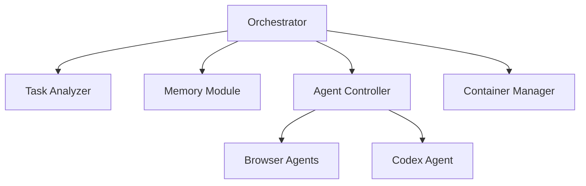
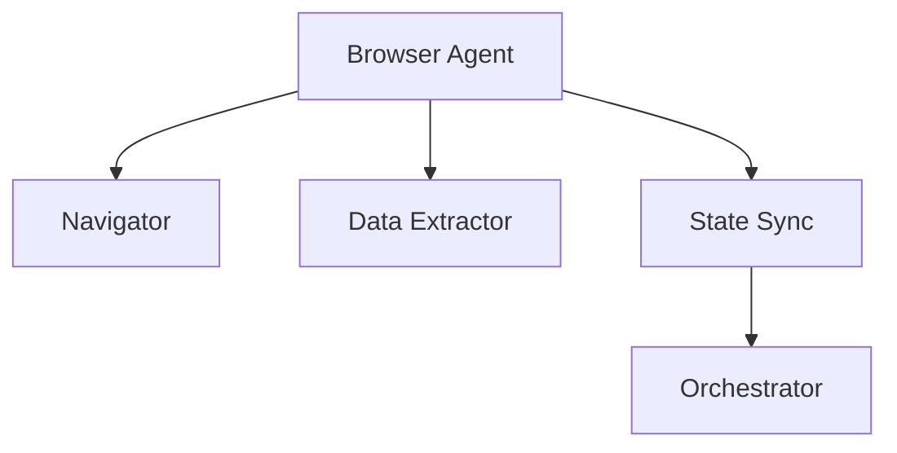
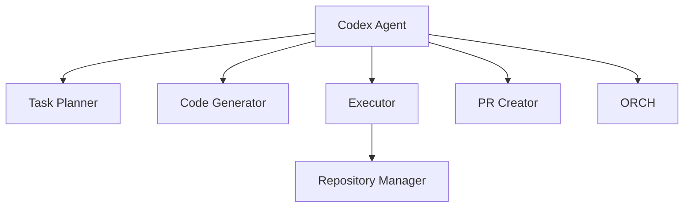

# AI Browser Automation Chat Interface

A web application that combines a chat interface with browser automation capabilities using E2B sandbox environment.

## Overview

This repository hosts the code for an autonomous coding assistant that can browse
the web, gather documentation and ultimately execute code inside a container. The
system is composed of a **Next.js** frontend and a **FastAPI** backend. The backend
exposes an **orchestrator agent** that coordinates specialised agents such as
browser automation and coding agents. Once documentation has been collected the
orchestrator can start a containerised coding agent to run tasks autonomously.

### Architecture Diagram

```mermaid
graph TD
    UI[Next.js Frontend] -->|HTTP call| API[FastAPI Backend]
    API --> ORCH[Orchestrator Agent]
    ORCH --> MEM[Memory Module\n(Azure AI Search)]
    ORCH --> BROWSER[Browser Agent(s)]
    ORCH --> CODE[Autonomous Coding Agent]
    BROWSER --> ORCH
    CODE --> ORCH
    ORCH --> API
    API --> UI
```

The orchestrator will use a **memory module** (implemented with Azure AI Search
and vector search) to recall past interactions and enrich new requests. Browser
agents are launched via Anchor/E2B services to collect information from the web,
while the coding agent runs inside a local or Azure container instance.

### Orchestrator Agent



The orchestrator analyses tasks, consults the memory module powered by Azure AI Search and dispatches work to browser or codex agents. The container manager launches coding agents in isolated environments.

### Browser Agent



Browser agents navigate sites, gather content and synchronise their state back to the orchestrator.

### Codex Agent



The codex agent plans tasks, generates code, executes commands and can create pull requests for resulting changes.

## Project Structure

```
.
├── frontend/           # Next.js frontend application
│   ├── components/    # React components
│   ├── pages/         # Next.js pages
│   └── styles/        # CSS styles
├── backend/           # FastAPI backend server
│   ├── app/          # Application code
│   └── tests/        # Test files
└── README.md         # This file
```

## Technologies Used

### Frontend
- Next.js 14
- Chakra UI
- TypeScript
- Axios for API calls

### Backend
- FastAPI
- Python 3.9+
- E2B Desktop
- Browser automation tools

## Prerequisites

- Node.js 18+
- Python 3.9+
- npm or yarn
- pip

## Setup Instructions

1. Clone the repository:
```bash
git clone <repository-url>
cd <project-directory>
```

2. Install backend dependencies:
```bash
cd backend
pip install -r requirements.txt
```

3. Install frontend dependencies:
```bash
cd frontend
npm install
```

4. Start the backend server:
```bash
cd backend
uvicorn app.main:app --reload
```
5. Start the frontend development server:
```bash
cd frontend
npm run dev
```

The application will be available at `http://localhost:3000`

## Request Flow

1. A user submits a task through the chat interface in the frontend.
2. The frontend sends the request to `/api/orchestrator` on the FastAPI backend.
3. The orchestrator consults the **memory module** (Azure AI Search & vectors)
   for relevant past context.
4. Depending on the task the orchestrator spins up browser agents to collect
   documentation and may launch the autonomous coding agent inside a container.
5. Agents stream their findings back to the orchestrator which aggregates the
   documentation.
6. Once documentation is complete the orchestrator can trigger a container
   running the coding agent to execute the desired changes and optionally open a
   pull request.
7. The backend returns session information and live view URLs which the frontend
   displays to the user in real-time.

## Features

- Real-time chat interface
- Browser automation visualization
- Task history tracking
- Responsive design

## Contributing

1. Fork the repository
2. Create your feature branch
3. Commit your changes
4. Push to the branch
5. Create a new Pull Request

## License

This project is licensed under the MIT License - see the LICENSE file for details. 
